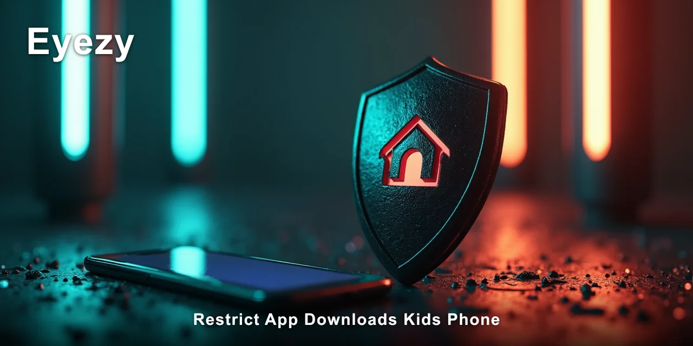
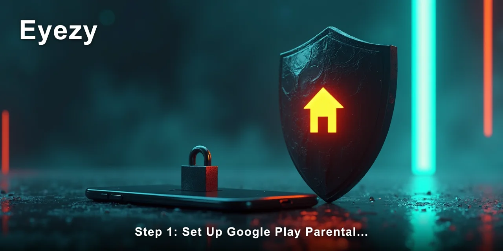

# How to Restrict App Downloads on Kids Phone

Restricting app downloads on your kid's phone is possible, but the built-in controls on Android and iOS are more limited than most parents expect. This guide walks through the exact steps to restrict app downloads on a kids phone using native settings, plus what to do when those controls aren't enough.

> [!NOTE]
> **Quick answer:** To restrict app downloads on a kids phone, use `Google Play` parental controls on Android or `Screen Time` on iPhone. These block new installs and require a PIN for purchases. For deeper control — including seeing what apps are used and when — you'll need a monitoring tool like **Eyezy** that works invisibly in the background.

I've spent years watching parents discover that the built-in restrictions have gaps. The PIN gets guessed. The workaround gets found. Or the kid simply uses a friend's phone. The thing is, the native tools are a good first layer, but they're not the whole answer.

Most parents assume that once they toggle on parental controls, the job is done. Then they find out their teenager downloaded a third-party app store or sideloaded an APK directly. The restrictions you set only cover the official channels, and that's where the real risk sits.

📌 **[Eyezy tracks this without the delays that make most alternatives unreliable.](https://redirectseo.com/e-en)**

## Contents

- [What You Need Before You Start](#what-you-need-before-you-start)
- [Step 1: Set Up Google Play Parental Controls on Android](#step-1-set-up-google-play-parental-controls-on-android)
- [Step 2: Use Screen Time to Restrict App Downloads on iPhone](#step-2-use-screen-time-to-restrict-app-downloads-on-iphone)
- [Step 3: Lock Down Third-Party App Stores and Sideloading](#step-3-lock-down-third-party-app-stores-and-sideloading)
- [Step 4: Verify the Restrictions Actually Work](#step-4-verify-the-restrictions-actually-work)
- [What to Do If the Built-In Restrictions Aren't Enough](#what-to-do-if-the-built-in-restrictions-arent-enough)
- [Troubleshooting Common Problems](#troubleshooting-common-problems)
- [Why Native Controls Alone Usually Fail](#why-native-controls-alone-usually-fail)
- [What You Should See After Completing These Steps](#what-you-should-see-after-completing-these-steps)
- [✅ Fast Recap](#-fast-recap)
- [Frequently Asked Questions](#frequently-asked-questions)

## What You Need Before You Start

Before you begin the process of restricting app downloads on a kids phone, gather these essentials. Most of this takes under 10 minutes, but the account details are the part people forget.

- [ ] Physical access to your child's phone for about 10 minutes
- [ ] Your Google account password (for Android) or Apple ID password (for iPhone)
- [ ] Your child's phone passcode or PIN
- [ ] The device's current OS version — check `Settings → About phone` or `Settings → General → About`
- [ ] A quiet moment to explain to your child why you're setting these limits

That last item matters more than most people think. I've observed that kids are far more likely to respect limits they understand than limits they discover by accident. The ones who find out through a blocked download tend to see it as a challenge.

## Step 1: Set Up Google Play Parental Controls on Android

This is the first and most direct way to restrict app downloads on a kids phone running Android. It blocks new installs, requires approval for purchases, and filters content by age rating. In practice, it covers the official app store completely.

1. Open `Google Play Store` on your child's device.
2. Tap the profile icon in the top-right corner, then select `Settings → Family → Parental controls`.
3. Toggle parental controls `On`. You'll be asked to create a PIN — this is the code that prevents your child from changing these settings.
4. Set the content restrictions under `Apps & games`. For a younger child, choose `Everyone` or `Everyone 10+`. For a teenager, `Teen` is usually appropriate.
5. Under `Purchase authentication`, select `Require authentication for all purchases`.

What you'll see after completing this: every attempt to install a new app from the Play Store will ask for the PIN you just created. Without it, the download simply won't proceed.

The most common mistake here is choosing a PIN your child already knows — like their own birthday or a repeated digit. I've seen this backfire more times than I'd like to admit. Pick something unrelated to family dates.

> [!IMPORTANT]
> If your child already knows the PIN or you suspect they've seen you enter it, change it immediately after setup. A PIN that's been observed is no PIN at all.

## Step 2: Use Screen Time to Restrict App Downloads on iPhone

For iPhones, the process to restrict app downloads on a kids phone runs through `Screen Time`. It's Apple's built-in parental control system, and it handles both installs and deletions.

1. Go to `Settings → Screen Time` on your child's iPhone.
2. Tap `Turn On Screen Time`, then select `This is My Child's iPhone`.
3. Create a `Screen Time passcode` — this is separate from the device passcode and must be kept private.
4. Tap `Content & Privacy Restrictions` and toggle it `On`.
5. Under `iTunes & App Store Purchases`, set `Installing Apps` and `Deleting Apps` to `Don't Allow`.

What you'll see: the App Store icon stays on the home screen, but tapping `Get` on any app produces a message saying installs are blocked. The `Screen Time` passcode is the only way around it.

One detail most parents miss: the `Don't Allow` setting also blocks app deletions. That's actually useful — it stops your child from removing a monitoring app or a school-required app without your knowledge.

If your child's iPhone runs `iOS 17.4` or later, you can also set `Communication Safety` in the same menu. It's not directly about downloads, but it adds a layer of protection for messages that contain sensitive content.

## Step 3: Lock Down Third-Party App Stores and Sideloading

The built-in controls work — until your child discovers alternative installation methods. This is the gap I've watched parents hit repeatedly. Restricting app downloads on a kids phone means closing every door, not just the front one.

On Android, third-party app stores like `APKPure` or `Aptoide` bypass Google Play entirely. To block them:

1. Open `Settings → Apps → Special access → Install unknown apps`.
2. Review every app on the list that has permission to install other apps.
3. Set each one to `Don't allow` — especially browsers, file managers, and messaging apps.
4. Check `Settings → Security → Google Play Protect` and ensure `Scan device for security threats` is on.

On iPhone, sideloading is harder but not impossible. The main risk is through `TestFlight` or enterprise certificates. In `Settings → General → VPN & Device Management`, you can see any installed profiles. If you see something unfamiliar, remove it.

> [!TIP]
> On Android, the `Install unknown apps` menu is the single most overlooked setting. I've found browsers and file managers with this permission enabled that parents never knew existed. Check it once a month — apps can request this permission during updates.

This is also where a monitoring tool becomes useful. **Eyezy** can show you which apps are actually installed on the device, including ones obtained outside the official stores. The native settings block what they can see, but they can't tell you what's already there.

In practice, I've seen teenagers sideload apps by downloading an APK through a messaging app, opening it from the chat thread, and granting install permission from there. The `Install unknown apps` setting is what stops that — but only if you've disabled it for every app, not just the obvious ones.

## Step 4: Verify the Restrictions Actually Work

Setting the controls is one thing. Confirming they hold up is another. To truly restrict app downloads on a kids phone, you need to test the restrictions yourself.

1. Attempt to download a free app from the official store on your child's device.
2. Confirm the PIN or passcode prompt appears and that entering the wrong code blocks the install.
3. Try installing an APK or IPA file directly to confirm sideloading is blocked.
4. Check `Settings → Screen Time` (iPhone) or `Google Play → Settings → Parental controls` (Android) to confirm the toggles are still on.
5. Set a reminder to re-check these settings every 30 days — kids figure out workarounds over time, not overnight.

What you'll see after this: a device that refuses installs without your PIN, blocks unknown sources, and shows a clear error message when your child tries to bypass it. That's the baseline.

The verification step is where I've noticed most parents skip ahead. They assume the setting stuck. Then two weeks later, they find a new game on the home screen and wonder how it got there. The answer is almost always that the child watched the parent enter the PIN once and memorised it.

If you want a record of what's happening on the device between your checks, that's where a phone monitoring app comes in.

✅ **[Eyezy works across both platforms here, which is where most single-device methods stop.](https://redirectseo.com/e-en)**

## What to Do If the Built-In Restrictions Aren't Enough

Sometimes the native controls just don't cut it. Maybe your child found a workaround, maybe you need visibility into what's being installed, or maybe you want to restrict app downloads on a kids phone across multiple devices from one dashboard. That's when parental monitoring software becomes the practical answer.

Monitoring apps like **Eyezy** run invisibly in the background. On Android, you install it once on the target device. On iPhone, it works through `iCloud` sync — no physical access needed after the initial setup. The app icon is hidden, and no notifications are sent to the device.

What it gives you that native controls don't:

- **App usage data:** which apps are installed, how often they're opened, and how much time is spent in each one
- **Web history:** what sites your child visits, including attempts to download apps from unofficial sources
- **Message monitoring:** SMS, WhatsApp, Instagram DMs, and other platforms where app download links often get shared
- **Screen time insights:** patterns of usage that reveal when restrictions are being tested or bypassed

I've noticed something interesting in the families I've worked with: the kids who try hardest to bypass restrictions are rarely the ones doing something dangerous. They're usually just curious or bored. But the ones who succeed at bypassing them are often the ones who need oversight most.

That's the uncomfortable gap in native parental controls. They block the action but give you no visibility into the attempt. A monitoring tool shows you both — the block working and the attempt happening.

> [!WARNING]
> Monitoring software should only be used on devices you own or have legal authority to monitor. On a child's phone that you pay for, this is generally acceptable — but check your local laws and be transparent with your child about what you're doing and why.

## Troubleshooting Common Problems

Even with the right settings, things go wrong. Here are the issues I've seen most often when parents try to restrict app downloads on a kids phone:

| Problem | Cause | Fix |
| --- | --- | --- |
| PIN not being asked for installs | Parental controls toggled off or never fully enabled | Re-open `Google Play → Settings → Parental controls` and confirm the toggle is on. Set a new PIN if needed. |
| Screen Time passcode forgotten | Passcode set once and never written down | Use your Apple ID to reset it via `Settings → Screen Time → Change Screen Time Passcode → Forgot Passcode?` |
| Apps installing anyway via unknown sources | `Install unknown apps` permission still enabled for a browser or file manager | Go to `Settings → Apps → Special access → Install unknown apps` and disable every app on the list. |
| Child knows the PIN | PIN was observed during setup or entry | Change the PIN immediately. Choose one with no connection to family dates or repeated digits. |
| Settings changed without PIN | Older Android versions allow settings changes from the lock screen | Check `Settings → Security → Lock screen` and disable `Show all notification content` and lock screen controls. |

The most common thread here is the PIN. It's the single point of failure in every parental control system I've tested. If the child knows it, the restriction is meaningless. If you forget it, you're locked out of your own controls.

Write the PIN down somewhere your child won't find it. I keep mine in a password manager, not on a sticky note near the family computer. That sounds obvious, but you'd be surprised how often parents leave it in plain sight.

For the `iPhone` route, the `Screen Time` passcode recovery through Apple ID works, but it takes about 24 hours. That's a long window if your child is actively trying to install apps during that time.

## Why Native Controls Alone Usually Fail

I want to be honest about this because it's the part nobody tells you. The built-in parental controls on both Android and iPhone are a solid first layer for restricting app downloads on a kids phone, but they have a structural weakness: they rely on a single secret (the PIN) and they give you no visibility into attempts to bypass them.

Here's what I've observed in real families:

- The PIN gets shared between siblings — older kids figure it out and pass it down
- Kids watch over your shoulder when you enter the PIN "just to check something"
- Friends at school know workarounds and share them freely
- Third-party app stores and sideloading bypass the Play Store and App Store entirely
- Kids use a friend's phone or a school device to download what they want

This isn't a criticism of the tools. It's just the reality of the arms race between parental controls and determined teenagers. The controls work for the casual download — the kind of impulse install most kids do. They struggle against the determined bypass.

The gap between these two scenarios is where I've seen parents get caught out. They assume the restriction is absolute, then discover it's conditional. The child didn't break the rule — they found a path the rule didn't cover.

That's why I recommend a layered approach. Native controls handle the obvious routes. A monitoring tool like **Eyezy** covers the gaps — showing you what's actually installed, what's being attempted, and what patterns are emerging. It's the difference between locking the front door and knowing who's trying the windows.

As of early 2026, roughly 60% of teenagers use messaging apps daily, and most app sharing happens through those platforms. A friend sends a link, your child taps it, and the download starts before any parental control can intervene.

The monitoring layer catches that — not by blocking it, but by showing you it happened so you can address it directly.

## What You Should See After Completing These Steps

If everything is set up correctly, here's what you should observe over the next few days:

When your child tries to download an app from the official store, a PIN prompt appears. Without the PIN, the download fails. If they attempt to sideload an APK, the install is blocked by the `Install unknown apps` restriction. On iPhone, the App Store shows a message that installs are not allowed.

Beyond the blocks, you should see a calmer relationship with the phone. The constant stream of new apps slows down. Your child asks before downloading something they actually need. The phone becomes a tool again rather than a pipeline for endless new distractions.

- [ ] A PIN or passcode prompt appears on every attempted install
- [ ] Sideloading via APK or IPA files is blocked
- [ ] Your child has been told about the restrictions and understands why they exist
- [ ] You've written down the PIN somewhere secure
- [ ] A monitoring tool (if used) is showing normal, expected activity

The last point matters. If you're using a monitoring app and you see nothing unusual, that's a good sign — but it's not a reason to stop checking. Patterns change, and kids test boundaries at different ages. The 12-year-old who never tries to bypass restrictions can become the 15-year-old who finds every workaround.

## ✅ Fast Recap

- Restricting app downloads on a kids phone starts with `Google Play` parental controls on Android or `Screen Time` on iPhone
- Always set a PIN your child doesn't know and change it if there's any chance it was observed
- Disable `Install unknown apps` for every app on Android — not just the obvious ones
- Test the restrictions yourself before trusting them
- Re-check settings every 30 days — kids find workarounds over time
- Native controls block the obvious routes but give no visibility into attempts
- Monitoring software adds the visibility layer that native controls lack

You now have a working system to restrict app downloads on a kids phone. The built-in controls handle the routine block, and the monitoring layer catches what slips through. It's not perfect — no system is — but it's a solid foundation that covers the gaps most parents never see coming.

The last thing I'll say is this: the goal isn't surveillance for its own sake. It's teaching your child to make better choices about what goes on their phone. The restrictions buy you time to have those conversations. The monitoring shows you when those conversations are needed. Both together create a safer digital environment than either one alone.

If you've followed every step here and you still feel like something's getting past you, that's the moment to look at what a monitoring tool can show you that native controls can't.

⚡ **[See what Eyezy actually captures here](https://redirectseo.com/e-en)**

## Frequently Asked Questions

### Does this work on both Android and iPhone?

Yes. The process differs by platform — `Google Play` parental controls on Android, `Screen Time` on iPhone — but both can effectively restrict app downloads on a kids phone. The settings achieve the same result through different menus.

### Will my child see any notification when I enable restrictions?

No. Enabling parental controls doesn't send a notification to the device. The child discovers the restriction when they try to download an app and hit the PIN prompt. That's often the moment you want to have the conversation about why the limits exist.

### Can my child bypass the restrictions with a VPN or third-party app store?

It's possible. On Android, third-party stores can bypass Google Play entirely, which is why you need to disable `Install unknown apps` for every app. A VPN doesn't bypass install restrictions, but it can hide web activity. Monitoring software is the layer that catches these attempts.

### How long does setup take?

About 10 minutes for the built-in controls on one device. Add another 5–10 minutes if you're installing monitoring software. The verification step takes another few minutes but is worth doing immediately rather than assuming everything worked.

### What should I do if my child already found a workaround?

Reset the PIN, re-check every permission setting, and close the specific loophole they used. Then add a monitoring layer to see what else they've been doing that you don't know about. The workaround they found is likely not the only one they've tried.